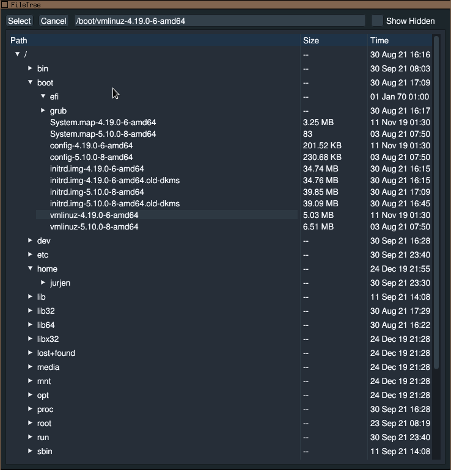

#FileTree browser
A little utility that displays a filesystem tree,
and then allows the user to select a file.

The path of the selected file will be written to stdout.

##Screenshots

##Why?
Written to learn the imgui library a bit.
Also I needed a file selection dialog for imgui :X
